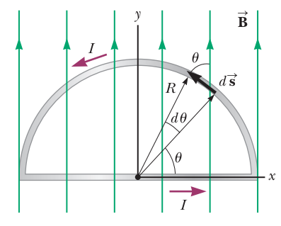
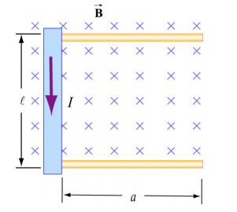

1- The **magnetic force** acting on a charge q traveling at a velocity $\vec v$ in a magnetic field $\vec B$ is given by:

$$\vec F_{B} = q \vec v \times \vec B $$

The magnitude is:

$$|\vec F_{B} | = |q| |\vec v| |\vec B| \sin \theta$$

2- The magnetic force $d\vec F_{B}$ generated by a small portion of current I of length $d \vec s$ in a magnetic field $\vec B$ is:

$$ d \vec F_B = I d \vec s \times \vec B$$

Thus for a straight segment:

$$ \vec F_B = I \vec L \times \vec B    $$

where $\vec L$ is a vector that points in the direction of the current I and has a magnitude equal to the length L of the segment. In general: **the net magnetic force acting on any closed current loop in a uniform magnetic field is zero.**

### Direction

{ width=100px }

{ width=700px }

### Unit

$$1 T = 1 \frac{N}{C \cdot m/s}  = 1 \frac{N}{A \cdot m}  = 10^4 G $$

\pagebreak

## Exercises

1) Determine the initial direction of the deflection of charged particles as they enter the magnetic fields:

{ width=300px }

2) A 0.200-kg metal rod carrying a current of 10.0 A glides on two horizontal rails 0.500 m apart. If the coefficient of kinetic friction between the rod and rails is 0.100, what vertical magnetic field is required to keep the rod moving at a constant speed? **Answer: 39.2mT**

3) A wire bent into a semicircle of radius R forms a closed circuit and carries a current
I. The wire lies in the xy plane, and a uniform magnetic field is directed along the positive y axis as in the figure below. Find the magnitude and direction of the magnetic force acting on the straight portion of the wire and on the curved portion. 

{ width=170px }

4) A rod with a mass m and a radius R is mounted on two parallel rails of length a separated
by a distance l , as shown in the Figure below. The rod carries a current I and rolls without
slipping along the rails which are placed in a uniform magnetic field $\vec B$  directed into the page. If the rod is initially at rest, what is its speed as it leaves the rails? 

{ width=120px }

