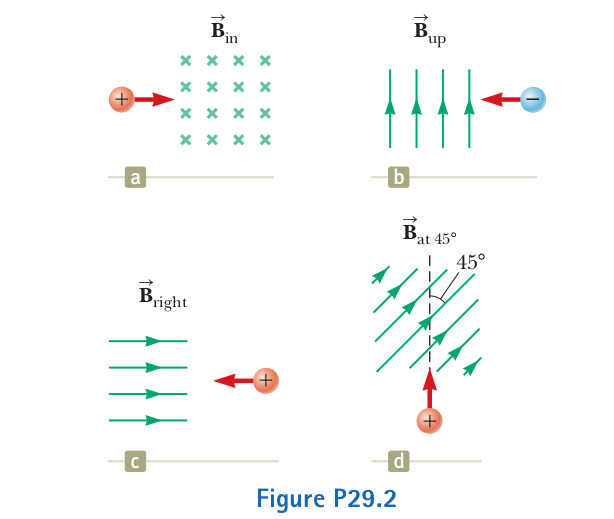

## Magnetic force

#### On a charged particle moving in a magnetic field

$$\vec F_{B} = q \vec v \times \vec B $$

The magnitude is:

$$|\vec F_{B} | = |q| |\vec v| |\vec B| \sin \theta$$

#### Wire

The magnetic force exerted on a very small segment $d \vec s$ is:
$$ d \vec F_B = I d \vec s \times \vec B$$

Thus for a straight segment:

$$ \vec F_B = I \vec L \times \vec B    $$

where $\vec L$ is a vector that points in the direction of the current I and has a magnitude equal to the length L of the segment. 

### Direction

{ width=400px }

### Unit

$$1 T = 1 \frac{N}{C \cdot m/s}  = 1 \frac{N}{A \cdot m}  = 10^4 G $$

\pagebreak

## Exercises

{ width=400px }

{ width=400px }

