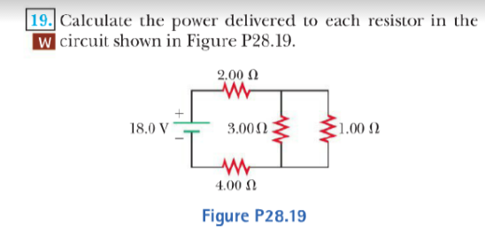

# Resistance 

The equivalent resistance of a set of resistors connected in a series combination is 

$$R_{eq} =  R_1 +  R_2+  R_3 ...$$

The equivalent resistance of a set of resistors connected in a parallel combination is found from the relationship:

$$\frac{1}{R_{eq}} = \frac{1}{R_1} + \frac{1}{R_2} $$

Circuits involving more than one loop are conveniently analyzed with the use of Kirchhoff’s rules:

1. **Junction rule.**. At any junction, the sum of the currents must equal zero:

$$\sum \limits_{Junction}  I =0$$

2. **Loop rule.** The sum of the potential differences across all elements around any circuit loop must be zero:

$$\sum  \limits   _{closed loop} \Delta V = 0 $$

### Voltage
$$\Delta V = IR$$

### Power

$$ P = I^2 R = \frac{(\Delta V)^2}{R}$$

### Excercise

{ width=400px }

