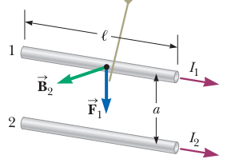
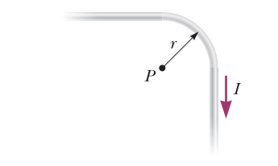
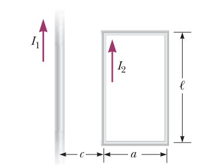

## Biot-Savart Law

The magnetic field $d \vec B$  at a point $P$ associated with a length element $d \vec s$  of a wire carrying a steady current $I$: 

$$d\vec B = \frac{\mu_0}{4 \pi} \frac{I d\vec s \times \hat r}{r^2}$$

where $d \vec s$ points in the direction of the current and $\hat r$ is the unit vector directed from $d\vec s$ towards $P$. 

## Magnetic Field due to a wire

See example 30.1 on your book

The magnitude of the magnetic field at a distance r from a long, straight wire carrying an electric current I is:
\begin{equation}
 B = \frac{\mu_0 I}{2 \pi r} 
 \end{equation}

## Magnetic Force Between Two Parallel Conductor

The field $\vec B_2$ due to the current in wire 2 exerts a magnetic force of magnitude $F_1 = I_1 l B_2$

{ width=200px }

$$ F_1 = I_1 l B_2 = I_1 l (\frac{\mu_0 I_2}{2 \pi a}) = \frac{\mu _0 I_1 I_2}{2 \pi a} l$$

\pagebreak

## Exercises

A long, straight wire carries a current I. A right-angle bend is made in the middle of the wire. The bend forms an arc of a circle of radius r. Determine the magnetic field at point P, the center of the arc. 

{ width=200px }

\vspace{7 cm}

2) In the figure below the current in the long, straight wire is $I_1$ and the wire lies in the plane of a rectangular loop, which carries a current $I_2$. The loop is of lenght $l$ and width $a$. Its left end is a distance $c$ from the wire. Find the magnitude and direction of the net force exerted on the loop by the magnetic field created by the wire. 

{ width=200px }

3) Proof equation (1) by finding the magnetic field of a wire by direct integration of Biot-Savart law. Hint: Find the magnetic field due to a wire of **finite** lenght then take the limit as the length of the wire goes to infinity. 

