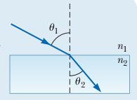
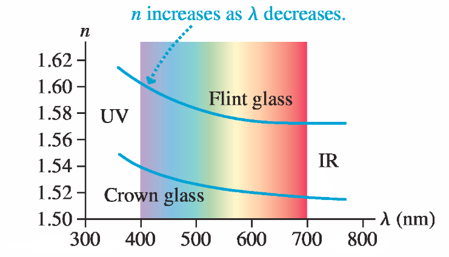
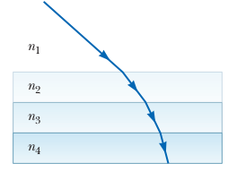
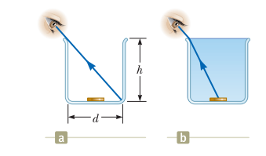
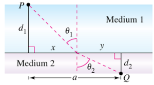

## Ray Approximation

In geometric optics, we use the **ray approximation**, in which a wave travels through a uniform medium in straight lines in the direction of the rays.

## Total Internal Reflection

Total internal reflection occurs when light travels from a medium of high index of refraction to one of lower index of refraction. The **critical angle** $\theta_c$ for which total internal reflection occurs at an interface is given by:

$$\sin \theta_c = \frac{n_2}{n_1} \, \, \text{(for $n_1$ > $n_2$)}$$

## Law of Reflection

For a light ray (or other type of wave) incident on a smooth surface, the angle of reflection $\theta_r$ equals the angle of incidence $\theta_i$:

## Snell's Law of Refraction:

$$n_1 \sin \theta_1 = n_2 \sin \theta_2$$

in terms of velocities: $v_2 \sin \theta_1 = v_1 \sin \theta_2$

{width=150px}

where $n_1$ and $n_2$ are the index of refraction of the two media and are defined by the ratio:

$$n \equiv \frac{c}{v}$$

where $c$ is the speef of light in vacuum and $v$ is the speed of light in the medium. 

## Dispersion
The slight variation of index of refraction with wavelength is known as dispersion.

{height=150px}

\pagebreak

## Exercises
<!--
1) The figure shows a light ray incident on a series of slabs having different refractive indices, where $n_1$ , $n_2$ , $n_3$ , $n_4$. Notice that the path of the ray steadily bends toward the normal. If the variation in n were continuous, the path would form a smooth curve. Use this idea and a ray diagram to explain why you can see the Sun at sunset after it has fallen below the horizon.

{height=100px}-->

A person looking into an empty container is able to see the far edge of the container’s bottom as shown in the figure below. The height of the container is h, and its width is d. When the container is completely filled with a fluid of index of refraction n and viewed from the same angle, the person can see the center of a coin at the middle of the container's bottom. Show that the ratio h/d is given by: 

$$\frac{h}{d} = \sqrt{\frac{n^2-1}{4-n^2}}$$

{height=150px}

### Snell’s law in geometric optics

3) One way to derive Snell's law is using the **Fermat's principle**. This principle states that light travels from one point to another following the path that requires the **least amount of time**. This is a typical one variable minimization problem.  See Exercixe 84 from your textbook for a nice derivation of snells law from Fermat principle. One way of minimizing a function is using the method of Lagrange Multipliers. This is a nice example of how the method of Lagrange multiplies can be applied in physics and maths

{height=150px}

Hint: You can write the expression for time as: 

$$T(\theta_1,\theta_2) = \frac{d_1}{\cos \theta_1 v_1} + \frac{d_2}{\cos \theta_2v_2} = \frac{d_1 n_1 }{\cos \theta_1 } + \frac{d_2 n_2 }{\cos \theta_2}   $$

subject to the constraint that: $$ g(\theta_1,\theta_2) = d_1 \tan \theta_1 + d_2 \tan \theta_2 - a = 0 $$. Your new function to minimize would be: 

$$\L(\theta_1,\theta_2,\lambda) = T(\theta_1,\theta_2) + \lambda \cdot g(\theta_1,\theta_2)$$

