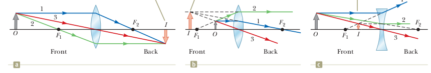

#### Image formation:

A **real image** is formed when all light rays pass through and diverge from the image point.

A **virtual image** is formed when most if not all of the light rays do not pass through the image point but only appear to diverge from that point

#### Magnification

$$M = \frac{\text{image height}}{\text{object height}} = \frac{h'}{h}$$

### Ray Diagrams for Lenses

Three **principal rays** are used to visualize the image location and size:

1.  For a converging lens ray 1 is drawn parallel to the principal axis. After being refracted by the lens, this ray passes through the **focal point** on the back side of the lens. For diverging lenses this ray emerges directed away from the focal point on the front side of the lens.

2. For a converging lens ray 2 is drawn through the focal point on the front side of the lens (or as if coming from the focal point if $p < f$ ) and emerges from the lens parallel to the principal axis. For diverging lens ray 2 is drawn in the direction toward the focal point on the back side of the lens and emerges from the lens parallel to the principal axis

3. For both diverging and convergin lenses: Ray 3 is drawn through the center of the lens and continues in a straight line.

### The thin lens equation

$$ \frac{1}{p} + \frac{1}{q} = \frac{1}{f} $$

where $p$ is the object location, $q$ is the image location and $f$ is the focal lenght. 

#### Magnification:

$$M = \frac{h'}{h} = -\frac{q}{p} $$

### Sign Conventions:

1. The focal length is positive for converging lenses and negative for diverging lenses.
2. The object distance is positive if the object is on the side of the lens from which the light is coming  otherwise, it is negative.
3. The image distance is positive if the image is on the opposite side of the lens from
where the light is coming; if it is on the same side, is negative. Equivalently,
the image distance is positive for a real image and negative for a virtual image.
4. The height of the image, is positive if the image is upright, and negative if the
image is inverted relative to the object. ( is always taken as upright and positive.)

\pagebreak

## Exercises

1)  Which of the following best describes the image from a plane mirror?
a. virtual and magnification greater than one
b. real and magnification less than one
c. virtual and magnification equal to one
d. real and magnification equal to one

2) The focal length of a lens is
a. the diameter of the lens.
b. the thickness of the lens.
c. the distance from the lens at which incoming parallel rays bend to intersect
at a point.
d. the distance from the lens at which all real images are formed.

3) You cover half of a lens that is forming an image on a screen. Compare what happens when you cover the top half of the lens versus the bottom half.

4) As an object moves from just outside the focal point of a converging lens to just inside it, the image goes from _____ and _____ to _____ and _____.

(a) large; inverted; large; upright.
(b) large; upright; large; inverted.
(c) small; inverted; small; upright.
(d) small; upright; small; inverted.

### Images formed by a converging lens

5) A **converging lens** has a focal length of 10.0 cm. **(A)** An object is placed 30.0 cm from the lens. Construct a ray diagram, find the image distance, and describe the image. **(B)** An object is placed 10.0 cm from the lens. Find the image distance and describe the image. **(C)** An object is placed 5.00 cm from the lens. Construct a ray diagram, find the image distance, and describe the image.

\vspace{2 cm}

6) A **diverging lens** has a focal length of 10.0 cm. **(A)** An object is placed 30.0 cm from the lens. Construct a ray diagram, find the image distance, and describe the image.**(B)** An object is placed 10.0 cm from the lens. Construct a ray diagram, find the image distance, and describe the image.**(C)** An object is placed 5.00 cm from the lens. Construct a ray diagram, find the image distance, and describe the image.

\vspace{ 1 cm}

7) A bright object and a viewing screen are separated by
a distance of 86.0 cm. At what location(s) between the
object and the screen should a lens of focal length 16.0 cm
be placed in order to produce a sharp image on the screen?
[Hint: First draw a diagram.]

8) A real object is place to the left of a converging lens and an image forms. Then, to the right of the converging lens a diverging lens is placed. A real, inverted final image forms to the right of the diverging lens. Which of the following could give this result?

a. An upright virtual image caused by the first lens forms between the two lenses.
b. An inverted real image caused by the first lens forms between the two lenses.
c. A real, upright image was formed by the first lens to the right of where the diverging lens is to be placed.
d. A real, inverted image was formed by the first lens to the right of where the diverging lens is to be placed.
