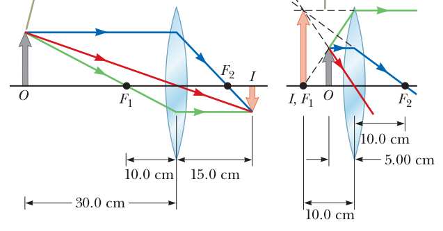
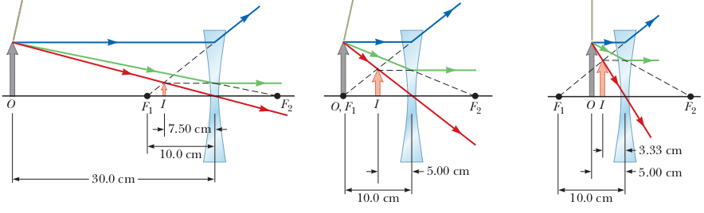
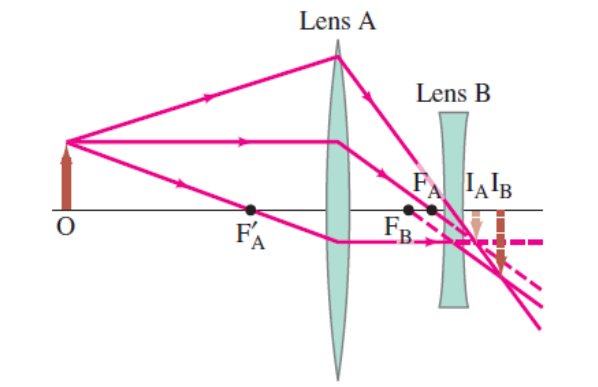

## Exercises

1)  Which of the following best describes the image from a plane mirror?

**c. virtual and magnification equal to one**

2) The focal length of a lens is

**c. the distance from the lens at which incoming parallel rays bend to intersect
at a point.**

3) You cover half of a lens that is forming an image on a screen. Compare what happens when you cover the top half of the lens versus the bottom half.

A common misconception is that each half of the lens produces half of the image. Actually, light from each part of the image passes through each part of the lens. When half of the lens is covered, the image is less intense, but the full image is still present on the screen. 

4) As an object moves from just outside the focal point of a converging lens to just inside it, the image goes from .....  and .....  to ....  and ....   .

**(a) large; inverted; large; upright.**

When the object is outside the focal length, the image is real and inverted. When the object is inside the focal length, the image is virtual and upright. And the closer the object is to the focal length, the greater the magnification, so the image is large in both cases. 

5) A **converging lens** has a focal length of 10.0 cm. **(A)** An object is placed 30.0 cm from the lens. Construct a ray diagram, find the image distance, and describe the image. **(B)** An object is placed 10.0 cm from the lens. Find the image distance and describe the image. **(C)** An object is placed 5.00 cm from the lens. Construct a ray diagram, find the image distance, and describe the image.

{width=250px}

**(A)**: $q = + 15.0$ cm. and $M= -0.5$. The the image is real and on the back side of the lens it is reduced in height by one half, and inverted. **(B)** $q=\infty$ This result means that rays originating from an object positioned at the focal point of a lens are refracted so that the image is formed at an infinite distance from the lens; that is, the rays travel parallel to one another after refraction. **(C)** $q=-10cm$ and $M=+2.00$. The image is virtual and formed on the side of the lens from which the light is incident, the front side. The image is enlarged and upright.

6) A **diverging lens** has a focal length of 10.0 cm. **(A)** An object is placed 30.0 cm from the lens. Construct a ray diagram, find the image distance, and describe the image.**(B)** An object is placed 10.0 cm from the lens. Construct a ray diagram, find the image distance, and describe the image.**(C)** An object is placed 5.00 cm from the lens. Construct a ray diagram, find the image distance, and describe the image.

{width=400px}

**(A)**: $q=-7.50$ cm. $M=+0.250$. The image is virtual, smaller than the object, and upright.**(B)**:$q=-5.00$ cm and $M=+0.5$.  For a diverging lens, an object at the focal point does not produce an image infinitely far away.**(C)**: $q=-3.33$ cm. $M=+0.66$. The image is virtual, smaller than the object, and upright.

\vspace{ 1 cm}

7) A bright object and a viewing screen are separated by
a distance of 86.0 cm. At what location(s) between the
object and the screen should a lens of focal length 16.0 cm
be placed in order to produce a sharp image on the screen?
[Hint: First draw a diagram.]

The sum of the object and the image distances must be the distance between object and screen, lets call this $d_T$. So we have $q + p = d_T$ and 

$$\frac{1}{p} + \frac{1}{q} =\frac{1}{p} + \frac{1}{d_T-p} = \frac{1}{f}$$

We get the quadratic equation: $p^2 - d_T p + f d_T =0$. We get for $\fbox{p = 21.3 , 64.7\, \text{cm}}$. 

8) A real object is place to the left of a converging lens and an image forms. Then, to the right of the converging lens a diverging lens is placed. A real, inverted final image forms to the right of the diverging lens. Which of the following could give this result?

**d. A real, inverted image was formed by the first lens to the right of where the diverging lens is to be placed.**

Two lenses, one converging with focal length 20.0 cm and one diverging with focal length are placed 25.0 cm apart. An object is placed 60.0 cm in front of the converging lens. Determine (a) the position and (b) Sketch a ray diagram for this system.

To solve this kind of problems we first find the location of the image formed by lnes 1 from the thin lens equation: $q_1 = 30$cm. This is then the object for the second lens. Since it is behind the lens the object distance $p_2$ is negative and $p_2 = 25 - 30 = -5$ cm, so we get for $q_2=10$ cm. So the second image is real and $\fbox{10 \text{cm beyond the second lens}}$

{width=250px}
