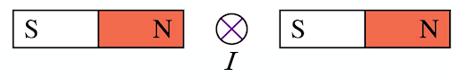

1) Two long parallel wires 20 cm apart carry currents of 5.0 A and 8.0 A in the same direction. Is there any point between the two wires where the magnetic field is zero? If so where?

\vspace{2 cm}

2) The figure shows a current-carrying wire passing between two bar magnets. Is there a force on the wire? If so, in what direction? If not, why not? 

{ width=200px }

\vspace{2 cm}

3) Explain why two parallel wires carrying currents in opposite directions repel each other.

\vspace{ 2 cm}

4) Find the direction of the current in the wire that would produce a magnetic field as showm:

{ width=300px }
