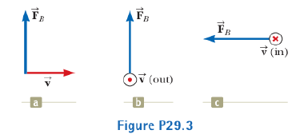
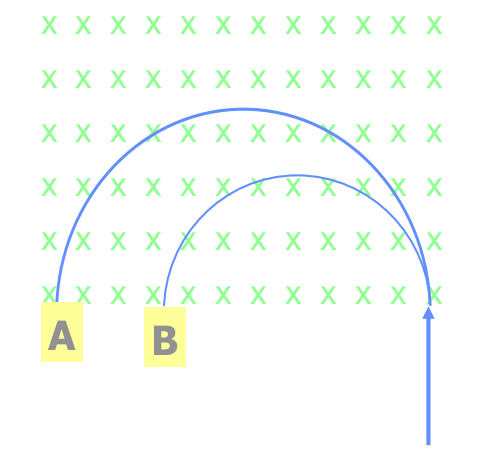

1) Find the direction of the magnetic field acting on a positively charged particle moving in the various situations show below if the direction of the magnetic force acting on it s as indicated. 

{ width=400px }

2) A proton with initial kinetic energy E is moving in circular motion in a uniform magnetic field. When it has completed one eighth of a revolution, what is its kinetic energy? Explain your reasoning. 

\vspace{2 cm}

3) When the velocity of a charged particle is **perpendicular** to a **uniform magnetic field**, the particle moves in a circular path in a plane perpendicular to $\vec B$. Consider the following situation: Two particles of the same charge enter a magnetic field with the same speed. Which one has the bigger mass? Explain your reasoning. This is the basic idea behing a mass spectrometer. 

{ width=200px }

**Bonus question**

Show that the radius of the circular path is proportional to the linear momentum, and inversely proportional to the magnitude of the charge and to the magnitude of the magnetic field. 

$$R = \frac{m v}{qB}$$

What is the period T? What would be the path if the velocity were at some arbitrary angle, not perpendicular, with respect to $\vec B$?
